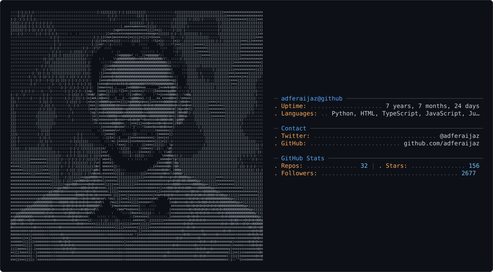

<!-- 

  

 -->
<h1 align="center">
  Hello 👋, I'm Adfer Aijaz
</h1>
<picture>
  <source media="(prefers-color-scheme: dark)" srcset="dark_mode.svg" />
  <source media="(prefers-color-scheme: light)" srcset="light_mode.svg" />
  
</picture>

<!-- ok -->
<!--

-->

<!--

  

- 👨‍💻 All of my projects are available at -

- 📝 I regularly write articles on -

- 💬 Ask me about **ML, AI, React, iOS, Android, Cloud and Opensource Development.**

<h3 align="left">Connect with me:</h3>

 -->
